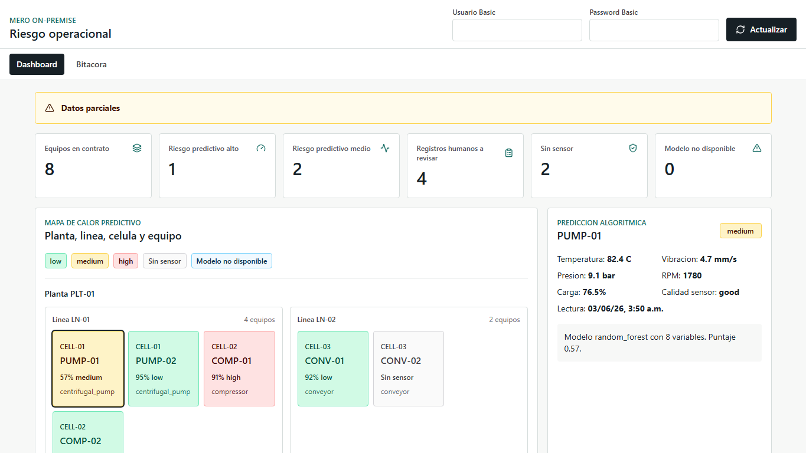
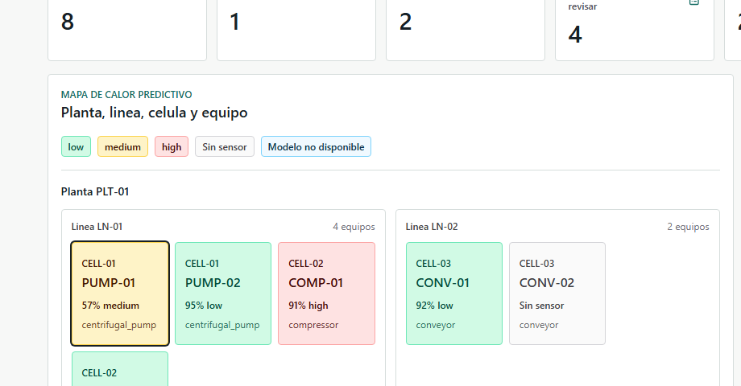
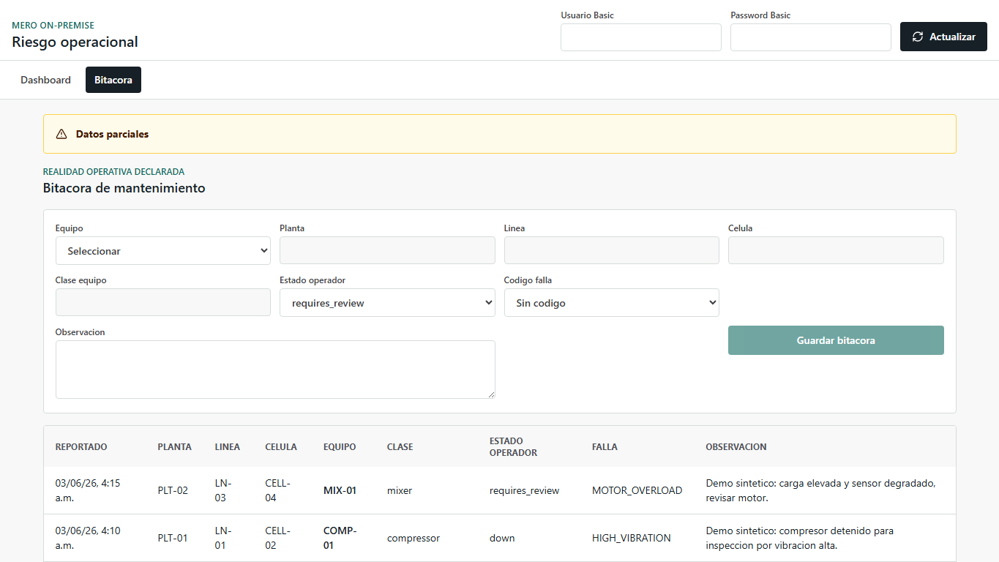
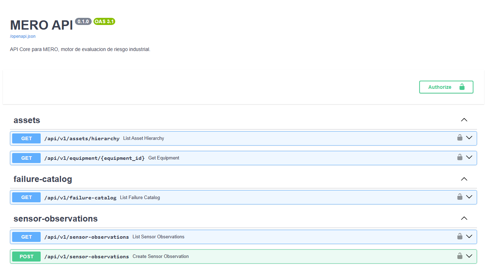
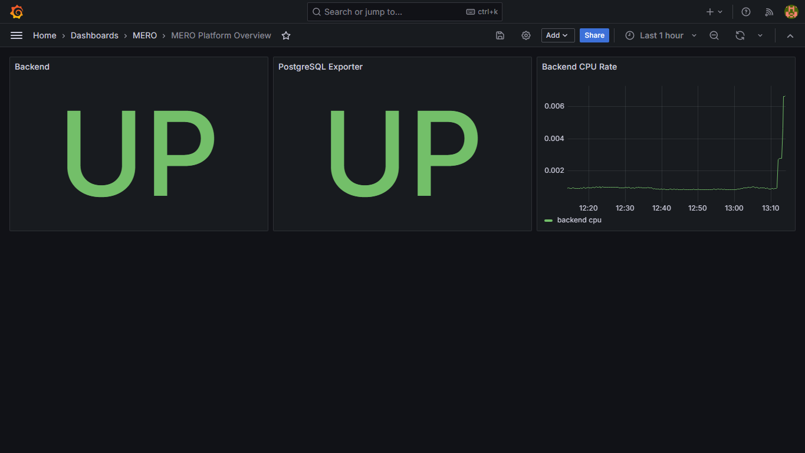

# Industrial Risk Evaluation Platform

Industrial Risk Evaluation Platform is an on-premise MVP for operational risk evaluation in industrial assets. It combines a FastAPI backend, a React dashboard, PostgreSQL, an offline machine learning pipeline, Prometheus metrics, Grafana dashboards, and automated PostgreSQL backups.

The project is designed as a technical portfolio and architecture demonstration for predictive maintenance workflows. The current machine learning model is functional for end-to-end integration, but it is trained with a deterministic demo dataset. It is not approved for real predictive pilots until validated with operational data and reviewed labels from maintenance personnel.

## Main Capabilities

- ISO 14224-inspired asset hierarchy: plant, production line, cell, and equipment.
- REST API with FastAPI and documented OpenAPI contracts.
- Basic Auth-protected business endpoints.
- React and TypeScript dashboard for operational risk review.
- Predictive heat map with `low`, `medium`, and `high` risk labels.
- Separate maintenance log view for human operator records.
- Offline ML training pipeline with KNN imputation, SMOTE, Random Forest, baseline metrics, confusion matrix, and model serialization.
- PostgreSQL persistence.
- Prometheus metrics for backend and database observability.
- Provisioned Grafana datasource and dashboard.
- Automated PostgreSQL backup container.
- QA, security, maintenance, and disaster recovery documentation.

## Architecture

```text
React frontend
    |
    | HTTP Basic Auth
    v
FastAPI backend
    |
    | SQLAlchemy
    v
PostgreSQL

FastAPI backend -> serialized ML model
FastAPI backend -> Prometheus metrics
PostgreSQL -> postgres-exporter -> Prometheus -> Grafana
PostgreSQL -> backup job -> local backup files
```

Docker Compose services:

- `frontend`: React SPA served by Nginx on port `3000`.
- `backend`: FastAPI API on port `8080`.
- `database`: PostgreSQL on port `5432`.
- `prometheus`: metrics collection on port `9090`.
- `grafana`: operational dashboard on port `3001`.
- `postgres-exporter`: PostgreSQL metrics exporter on the internal network.
- `db-backup`: automated PostgreSQL dump job.

## Tech Stack

- Backend: Python, FastAPI, SQLAlchemy, Pydantic.
- Frontend: React, TypeScript, Vite, Tailwind CSS.
- Machine learning: Pandas, Scikit-learn, Imbalanced-learn, Joblib.
- Database: PostgreSQL.
- Observability: Prometheus, Grafana, postgres-exporter.
- Runtime: Docker Compose.

## Repository Structure

```text
.
|-- docker-compose.yml
|-- .env.example
|-- docs/
|-- monitoring/
|-- scripts/
|-- src/
|   |-- api/
|   |-- db/
|   |-- ml/
|   `-- web/
|-- tests/
|-- data/
`-- artifacts/
```

## Local Setup

Prerequisites:

- Docker Desktop or Docker Engine with Docker Compose.
- Python 3.12 for local training, migrations, and tests.
- Node.js if running frontend tests outside Docker.

Create the local environment file:

```sh
cp .env.example .env
```

Edit `.env` and replace every `CHANGE_ME` value before starting the stack.

Start the platform:

```sh
docker compose up -d --build
```

Bootstrap demo data, migrations, model artifact, and a prediction smoke check:

```sh
python scripts/bootstrap-demo.py
```

The bootstrap command:

- Generates `data/training_seed.csv`.
- Trains `artifacts/models/random_forest.joblib`.
- Writes `artifacts/models/random_forest_metrics.json`.
- Applies SQL migrations.
- Inserts a synthetic demo hierarchy with 2 plants, 3 lines, 4 cells, 8 equipment records, failure catalog, sensor observations, maintenance logs, and thresholds.
- Leaves 2 demo equipment records without recent sensors so the dashboard can show partial-data states.
- Verifies `/api/v1/predictions/risk` with `PUMP-01`.

Use `python scripts/bootstrap-demo.py --restart-backend` when you need to refresh a backend that already cached a previous model.

End-to-end demo flow from a clean checkout:

```sh
cp .env.example .env
docker compose up -d --build
python scripts/bootstrap-demo.py
```

## Local URLs

- Frontend: `http://localhost:3000`
- Backend health: `http://localhost:8080/health`
- Backend metrics: `http://localhost:8080/metrics`
- API docs: `http://localhost:8080/docs`
- Prometheus: `http://localhost:9090`
- Grafana: `http://localhost:3001`

Use the Basic Auth credentials configured in `.env` for the application API and frontend form. Use the Grafana credentials configured in `.env` for Grafana.

## Screenshots

The screenshots below use synthetic demo data and do not show passwords, tokens, connection strings, or raw credentials.

### Dashboard



### Risk Heat Map



### Maintenance Log



### API Docs



### Grafana



## Testing

Backend tests:

```sh
pytest
```

Frontend tests:

```sh
cd src/web
npm install
npm run test
npm run build
```

## Machine Learning Status

The current model is a reproducible demo model trained from `data/training_seed.csv`. It validates the technical integration between the ML pipeline, backend, and frontend.

It should not be treated as an operational predictive model because:

- It is not trained with real plant data.
- Labels have not been reviewed by maintenance personnel.
- Current metrics are based on a demo dataset and random split.
- A real pilot requires temporal validation and false-negative analysis for `high` risk events.

The expected path for a real pilot is documented in:

- `docs/demo-data.md`
- `docs/data-dictionary-real.md`
- `docs/ml-calibration-report.md`
- `docs/model-validation-report.md`
- `docs/audit-report-2026-05-23-ml-calibration-review.md`

## Security Notes

- Do not commit `.env`.
- Do not commit real backups, logs, production datasets, or model artifacts trained with client data.
- Rotate credentials before using the project outside a local demo environment.
- Restrict PostgreSQL port exposure in non-local deployments.
- TLS and encryption-at-rest must be configured according to the target environment before production use.

## Documentation

Key documents:

- `docs/architecture.md`: service architecture.
- `docs/api.md`: API contract.
- `docs/database.md`: database model.
- `docs/security.md`: security notes.
- `docs/maintenance.md`: maintenance procedures.
- `docs/disaster-recovery.md`: recovery procedures.
- `docs/execution-sequence-status.md`: audited execution sequence.

## Portfolio Summary

This project demonstrates the design and implementation of an industrial risk evaluation platform with:

- Full-stack development.
- REST API design.
- Industrial asset modeling.
- Machine learning pipeline integration.
- Observability and backup operations.
- Security and QA governance.
- Clear separation between algorithmic predictions and human maintenance records.

Recommended CV description:

```text
Designed and implemented an on-premise Industrial Risk Evaluation Platform using FastAPI, React, PostgreSQL, Docker Compose, Scikit-learn, Prometheus, and Grafana. Built a predictive maintenance MVP with ISO 14224-inspired asset hierarchy, REST inference endpoint, operational dashboard, maintenance log module, automated backups, and QA/security documentation.
```

## Project Status

Status: technical MVP ready for portfolio presentation.

Not production-ready as a real predictive maintenance system until trained and validated with real operational data.
